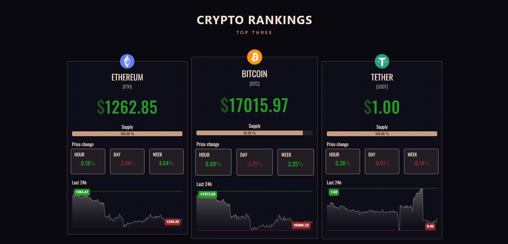
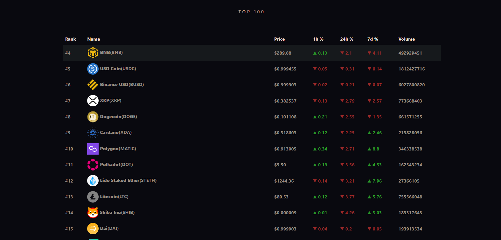

# Crypto Rankings

Web application developed using latest technologies that shows the top three cryptocurencies.
- using terminal commands
- fundamentals of react.js: components, imports, props, states, installing modules
- consuming apis using fetch: public api ([CoinStats](https://documenter.getpostman.com/view/5734027/RzZ6Hzr3))
- configuring chart.js

